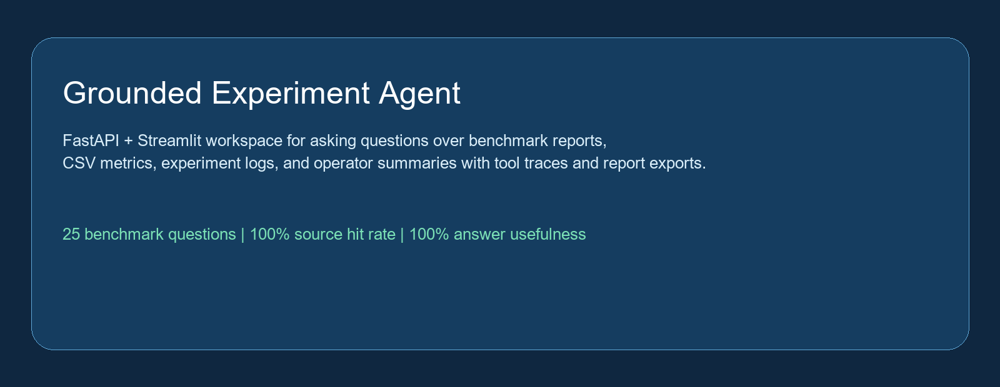
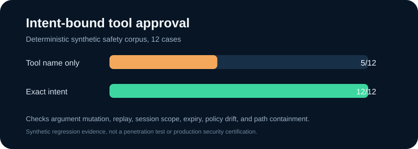
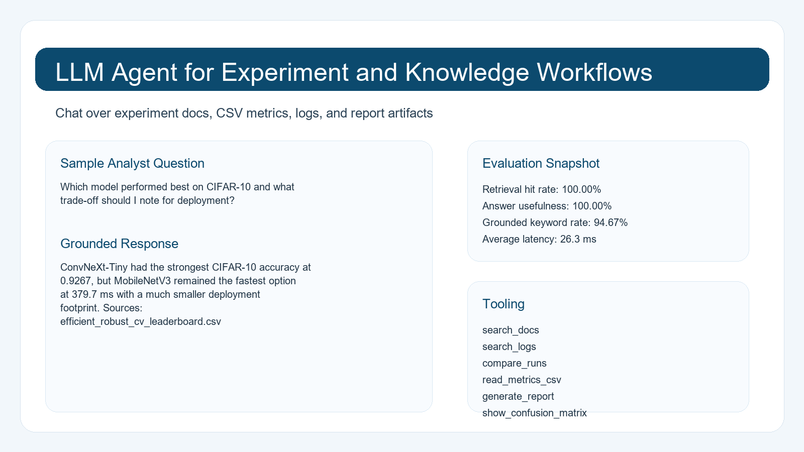
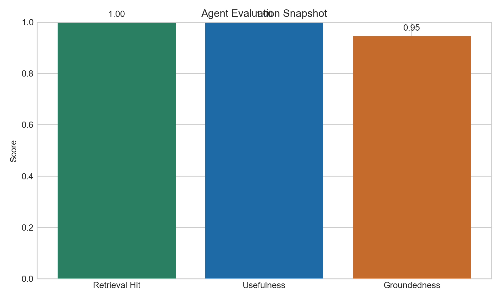
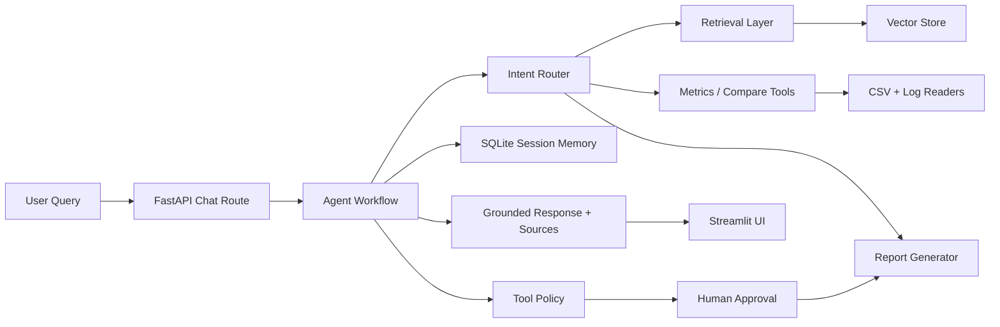

# LLM Agent for Experiment and Knowledge Workflows

[](https://github.com/Ikteder/llm-agent-workflows/actions/workflows/ci.yml)






An agent workspace for researchers and engineers who want more than a chatbot. This project answers questions over experiment reports, CSV metrics, and logs; compares runs across projects; generates grounded reports; keeps session memory in SQLite; and returns cited source chunks with every answer. Report writes now pause behind an exact-intent, single-use approval boundary.

The corpus is built from real outputs generated in other showcase repos:

- predictive maintenance with early warning and drift detection
- model export and inference benchmarking
- efficient and robust computer vision benchmarking

## Why This Project Stands Out

- It looks like internal ML tooling, not a single notebook.
- It combines backend APIs, retrieval, tool use, memory, evaluation, and reporting.
- It is grounded in real experiment artifacts instead of toy text files.
- It ships with an evaluation harness and benchmark question set, not just a demo.
- Its write tool is governed by a visible policy, exact server-held arguments, project scope, expiry, one-time consumption, and an audit trail.

## What It Does

- `search_docs`: retrieve grounded chunks from Markdown reports and READMEs
- `search_logs`: search JSON and log files for run events
- `compare_runs`: compare metrics across CSV outputs and rank results
- `read_metrics_csv`: preview and inspect metric tables
- `show_confusion_matrix`: surface artifact paths for relevant confusion matrices
- `summarize_failures`: extract failure-pattern summaries from benchmark docs
- `generate_report`: write Markdown and HTML only after exact-intent approval

## Tool Policy and Approval Flow

Read tools remain available without interruption. The report tool is different because it creates files.

1. The agent validates the project scope and plans the report with complete source bindings.
2. The server stores the exact tool name, arguments, session, project, policy version, expiry, and keyed digest.
3. The API or Streamlit interface shows the pending call and accepts an explicit approve or reject decision.
4. A resumed request names that approval ID. The server executes the stored invocation, not a newly generated replacement.
5. Approval is consumed before the write. Replays, expired requests, different sessions, unknown projects, stale policies, and escaped paths fail closed.

This is local application approval, not user authentication or multi-tenant authorization. Put the API behind appropriate identity and transport controls before a network deployment.

## Showcase Screens





## Evaluation Snapshot

The benchmark harness runs 25 grounded questions over the real corpus in [benchmark_questions.json](artifacts/benchmark_questions.json). Latest generated metrics from [eval_summary.json](artifacts/generated/eval_summary.json):

- Retrieval hit rate: `100%`
- Answer usefulness: `100%`
- Grounded keyword rate: `90.67%`
- Average latency: `22.68 ms`
- Hallucination proxy: `0%`

The new `tool-policy-safety-v1` corpus contains twelve deterministic cases.

| Evaluator | Correct cases | Accuracy |
|---|---:|---:|
| Tool-name-only approval baseline | 5 / 12 | 41.67% |
| Exact-intent policy | 12 / 12 | 100% |

The corpus targets implemented controls and is not an independent penetration test or production security certification.

Full outputs:

- [Evaluation summary](artifacts/generated/evaluation_summary.md)
- [Evaluation results JSON](artifacts/generated/eval_results.json)
- [Sample generated report](artifacts/generated/sample_cross_project_report.md)
- [Sample generated report (HTML)](artifacts/generated/sample_cross_project_report.html)

## Demo Questions

- `Which model performed best on this dataset?`
- `Compare the last ResNet and MobileNetV3 runs.`
- `Which predictive maintenance method had the best F1 score?`
- `Did the ONNX export for ResNet18 pass verification?`
- `Summarize the failure cases from the computer vision benchmark.`
- `Generate a short experiment report from the latest benchmark and maintenance results.`

## Architecture



## Repository Layout

```text
llm-agent-workflows/
├── app/
│   ├── api/
│   ├── agent/
│   ├── models/
│   ├── retrieval/
│   └── services/
├── data/
│   ├── docs/
│   ├── logs/
│   ├── csv/
│   ├── reports/
│   └── artifacts/
├── frontend/
│   └── streamlit_app.py
├── artifacts/
│   ├── benchmark_questions.json
│   └── generated/
├── scripts/
├── tests/
└── README.md
```

## Implementation Notes

- Default retrieval uses `TF-IDF` embeddings so the demo works locally without downloading a large embedding model.
- The code also supports `sentence-transformers`; set `EMBEDDING_BACKEND=sentence-transformer` to switch.
- Default answer generation uses a deterministic grounded summarizer for reproducibility.
- If `OPENAI_API_KEY` is set and `LLM_BACKEND=openai`, the agent can upgrade the final answer generation step with the OpenAI API.
- Session history is stored in SQLite so the chat retains short-term memory across turns.

## Run Locally

1. Create the environment and install dependencies.

```bash
python -m venv .venv_run
.venv_run\Scripts\python -m pip install -r requirements.txt
.venv_run\Scripts\python -m pip install -e . --no-deps
```

2. Start the API.

```bash
.venv_run\Scripts\python -m uvicorn app.main:app --reload
```

3. Start the Streamlit frontend in a second terminal.

```bash
.venv_run\Scripts\python -m streamlit run frontend/streamlit_app.py
```

4. Rebuild the demo assets and evaluation bundle when needed.

```bash
.venv_run\Scripts\python scripts/build_demo_assets.py
.venv_run\Scripts\python -m scripts.evaluate_tool_policy --json artifacts/generated/tool-policy-benchmark.json --svg docs/graphics/tool-policy-benchmark.svg
```

## Approval API Example

First request a report. The API returns `approval_required` and does not create a file.

```bash
curl -X POST http://127.0.0.1:8000/api/chat \
  -H "Content-Type: application/json" \
  -d '{"session_id":"demo","project":"predictive_maintenance","question":"Generate a maintenance report","generate_report":true}'
```

Approve the returned ID, then repeat the original request with `approval_id`. The Streamlit interface performs this resume flow through explicit buttons.

## API Example

```bash
curl -X POST http://127.0.0.1:8000/api/chat ^
  -H "Content-Type: application/json" ^
  -d "{\"session_id\":\"demo\",\"project\":\"efficient_robust_cv\",\"question\":\"Which model performed best on CIFAR-10?\",\"generate_report\":false}"
```

## Testing

```bash
.venv_run\Scripts\python -m pytest -q
```

Current deterministic validation:

- `pytest`: `18 passed`
- `uvicorn --help`: passed
- demo asset build: passed
- evaluation benchmark: `25 / 25` grounded benchmark questions correct
- tool policy corpus: exact intent `12 / 12`; tool-name baseline `5 / 12`

## Best Files To Open First

- [FastAPI app entrypoint](app/main.py)
- [Agent workflow](app/agent/graph.py)
- [Tool implementations](app/agent/tools.py)
- [Retrieval ingestion](app/retrieval/ingest.py)
- [Evaluation builder](scripts/build_demo_assets.py)
- [Benchmark set](artifacts/benchmark_questions.json)

## Honest Note

This repo is intentionally optimized for reproducibility and grounded outputs. The default demo path favors deterministic retrieval and tool-based summarization over a fully autonomous long-horizon agent loop, which keeps the benchmark stable and makes the evaluation results meaningful.

The tool policy is provider-neutral application code. It was influenced by current approval and tool-safety guidance from OpenAI Agents SDK, Pydantic AI, LangChain and LangGraph, and the Model Context Protocol specification. No upstream code was copied. See the [dated reference review](docs/notes/2026-10-01-tool-policy-reference-review.md).

## Limitations

- The checked-in benchmark is a compact deterministic evaluation over bundled artifacts, not evidence of general agent reliability.
- Retrieval quality depends on document formatting and the included TF-IDF representation.
- The default path does not evaluate adversarial instructions, multi-user isolation, long-running orchestration, or production access controls.
- External-model behavior and cost are not covered by the offline test suite.
- The approval endpoint does not authenticate a person. A public or shared deployment still needs authentication, authorization, CSRF protection where applicable, and transport security.
- Pending approvals are in process memory and fail closed across restart; the JSONL log is evidence, not resumable authority.
- Version 0.2 gates one filesystem write tool. It does not sandbox arbitrary code, networks, shell tools, or external MCP servers.
- The twelve-case policy corpus is synthetic, implementation-aligned regression evidence.

## Best Next Improvement

Add an authenticated reviewer identity and durable compare-and-swap approval store, then stress concurrent approve, reject, consume, expiry, and restart races with an independently authored corpus.

## Project Records

- [Approved tool policy spec](docs/superpowers/specs/2026-10-01-intent-bound-tool-policy.md)
- [Reference comparison and impact gate](docs/notes/2026-10-01-tool-policy-reference-review.md)
- [Exact-intent decision record](docs/decisions/2026-10-01-server-held-exact-intent-approvals.md)
- [Policy corpus dataset card](docs/datasets/tool-policy-safety-v1.md)
- [Model and provider card](docs/models/2026-10-01-model-provider-card.md)
- [Verification record](docs/experiments/2026-10-01-tool-policy-verification.md)

## License

Released under the [MIT License](LICENSE).
