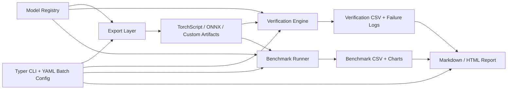

# Model Export, Validation, and Inference Benchmarking Toolkit


This project is a deployment-oriented toolkit for exporting models to multiple formats, validating numerical consistency after export, benchmarking runtime performance, and generating shareable reports. It covers a mixed model set across tabular ML, vision, and small language-model inference so the system feels like a real internal tooling project rather than a single-model demo.

## Why this project is strong

- It shows software engineering, not just model training.
- It combines export tooling, runtime validation, benchmarking, reporting, and CLI design in one reproducible system.
- It reflects real deployment workflows where exported artifacts must be verified before they are trusted.
- It compares native runtimes, ONNX Runtime, TorchScript, and a custom portable format in one batch pipeline.

## Core use cases

```bash
model-toolkit export resnet18 --output-dir outputs/resnet --formats torchscript,onnx,npz
model-toolkit verify logistic-regression --output-dir outputs/logreg-check --formats onnx,npz
model-toolkit benchmark xgboost --output-dir outputs/xgb-bench --formats onnx,npz --batch-size 8
model-toolkit report --verification-csv outputs/demo/verification_summary.csv --benchmark-csv outputs/demo/benchmark_summary.csv --output-dir outputs/report
model-toolkit batch-run configs/demo-batch.yaml
```

## Supported models

| Category | Model key | Model |
| --- | --- | --- |
| Tabular | `logistic-regression` | Logistic Regression |
| Tabular | `xgboost` | XGBoost Classifier |
| Vision | `resnet18` | ResNet18 |
| Vision | `mobilenetv3` | MobileNetV3 Large |
| Vision | `efficientnet-b0` | EfficientNet-B0 |
| Language | `distilgpt2` | DistilGPT-2 style causal LM workflow |

## Export formats

- `TorchScript` for PyTorch-native models
- `ONNX` for PyTorch, Logistic Regression, and XGBoost
- custom portable `NPZ + JSON metadata` format

The custom format is especially useful for validation and lightweight portability. For XGBoost it stores the booster payload in the custom artifact path, while the shared metadata file keeps the runtime information readable.

## What the toolkit measures

- export success or failure
- max absolute error
- mean absolute error
- max relative error
- latency per inference
- throughput
- peak RSS memory
- serialized model size

## Demo findings

### Benchmark gallery


### Model size comparison


### Headline results from the generated demo batch

- All demo verification checks passed.
- `XGBoost / ONNX` was the fastest path in the full batch at about `0.03 ms` latency for an 8-row tabular batch.
- `Logistic Regression / ONNX` reached roughly `320k items/sec`, while the custom `NPZ` path reached roughly `487k items/sec` because its runtime is just direct coefficient evaluation.
- `MobileNetV3 / ONNX` was the fastest vision runtime at about `15.94 ms`, beating both baseline PyTorch and TorchScript.
- `EfficientNet-B0 / ONNX` dropped latency from about `50.24 ms` in baseline PyTorch to `31.43 ms`.
- `DistilGPT-2` preserved exact parity in the custom `NPZ` export, though the compact wrapper benchmark this time was slightly faster in baseline PyTorch than in the custom path.
- `XGBoost / ONNX` shrank to about `0.016 MB`, while the custom artifact shrank further to about `0.010 MB`.

## Verification snapshot

| Model | Format | Max abs error | Mean abs error | Max rel error | Passed |
| --- | --- | ---: | ---: | ---: | --- |
| Logistic Regression | ONNX | 0.00000161 | 0.00000028 | 0.00066233 | Yes |
| Logistic Regression | NPZ | 0.00000119 | 0.00000018 | 0.00000853 | Yes |
| XGBoost | ONNX | 0.00000009 | 0.00000004 | 0.00000239 | Yes |
| XGBoost | NPZ | 0.00000000 | 0.00000000 | 0.00000000 | Yes |
| ResNet18 | ONNX | 0.00000238 | 0.00000053 | 0.00016466 | Yes |
| MobileNetV3 | ONNX | 0.00000000 | 0.00000000 | 0.00000000 | Yes |
| EfficientNet-B0 | ONNX | 0.00000000 | 0.00000000 | 0.00000000 | Yes |
| DistilGPT-2 | NPZ | 0.00000000 | 0.00000000 | 0.00000000 | Yes |

## Benchmark snapshot

| Model | Format | Latency ms | Throughput | Peak RSS MB | Size MB |
| --- | --- | ---: | ---: | ---: | ---: |
| Logistic Regression | baseline | 0.1109 | 72130.56 | 471.71 | 0.0009 |
| Logistic Regression | ONNX | 0.0250 | 319872.05 | 471.86 | 0.0007 |
| Logistic Regression | NPZ | 0.0164 | 486618.00 | 471.86 | 0.0007 |
| XGBoost | baseline | 0.3509 | 22796.57 | 474.32 | 0.0459 |
| XGBoost | ONNX | 0.0314 | 254858.24 | 474.46 | 0.0161 |
| XGBoost | NPZ | 0.7056 | 11337.71 | 474.47 | 0.0101 |
| MobileNetV3 | baseline | 40.7270 | 24.55 | 705.07 | 21.1074 |
| MobileNetV3 | ONNX | 15.9411 | 62.73 | 757.21 | 20.8562 |
| EfficientNet-B0 | baseline | 50.2415 | 19.90 | 839.80 | 20.4535 |
| EfficientNet-B0 | ONNX | 31.4262 | 31.82 | 908.86 | 20.0704 |
| DistilGPT-2 | baseline | 31.7161 | 31.53 | 1054.02 | 309.6862 |
| DistilGPT-2 | NPZ | 38.0399 | 26.29 | 1057.56 | 422.8854 |

## System design



## Project layout

| Path | Purpose |
| --- | --- |
| `src/model_toolkit/registry.py` | model factories, fitted tabular models, and sample inputs |
| `src/model_toolkit/exporters.py` | TorchScript, ONNX, and custom export logic |
| `src/model_toolkit/loaders.py` | baseline and exported-runtime loaders |
| `src/model_toolkit/verification.py` | numerical parity checks and failure logging |
| `src/model_toolkit/benchmark.py` | latency, throughput, memory, and size benchmarking |
| `src/model_toolkit/reporting.py` | chart generation and Markdown/HTML reports |
| `src/model_toolkit/cli.py` | CLI entrypoint |
| `configs/demo-batch.yaml` | showcase batch configuration |
| `outputs/demo/` | generated CSVs, charts, and reports |

## Local setup

```powershell
py -3.13 -m venv .venv
.venv\Scripts\python.exe -m pip install -r requirements.txt
.venv\Scripts\python.exe -m pip install -e .
```

## Run the showcase batch

```powershell
.venv\Scripts\python.exe -m model_toolkit.cli batch-run configs\demo-batch.yaml
```

## Testing

```powershell
.venv\Scripts\python.exe -m pytest
```

## Docker

```powershell
docker build -t model-toolkit .
docker run --rm model-toolkit
```

## Demo outputs in this repo

- Benchmark CSV: [outputs/demo/benchmark_summary.csv](outputs/demo/benchmark_summary.csv)
- Verification CSV: [outputs/demo/verification_summary.csv](outputs/demo/verification_summary.csv)
- Markdown report: [outputs/demo/report.md](outputs/demo/report.md)
- HTML report: [outputs/demo/report.html](outputs/demo/report.html)

Large exported binaries are intentionally excluded from git so the repository stays lightweight. The checked-in reports, charts, and CSV summaries come from the included batch pipeline and can be regenerated locally with the demo config.

## Resume-ready framing

**Model Export, Validation, and Inference Benchmarking Toolkit**  
Built a Python CLI toolkit for exporting vision, tabular, and language models to deployment formats, validating numerical consistency across runtimes, and benchmarking latency, throughput, memory, and artifact size to support reproducible deployment workflows.
